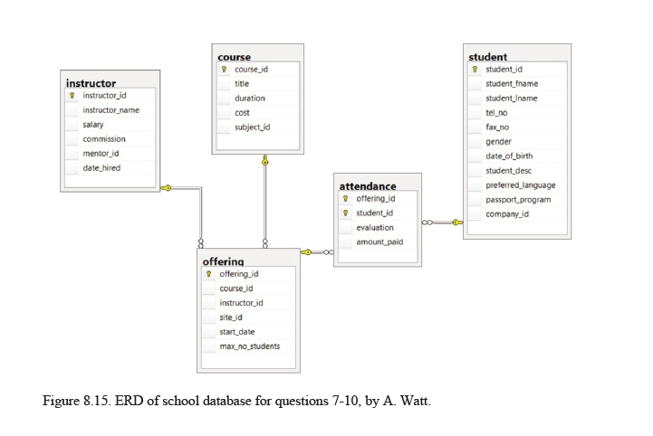

# 📘 Day 1: MongoDB Basics – Databases, Collections & Inserts

Setting up databases, creating collections by inserting documents, and viewing data.

---

## 🧠 Objectives
By the end of this lesson, you should be able to:

- Understand MongoDB's structure: **Database → Collection → Document**
- Create and switch databases using MongoDB Shell or Compass
- Insert single and multiple documents into collections
- View basic inserted data

---

## 🏗️ MongoDB Structure Overview

| Concept     | Equivalent In SQL | Example                            |
|-------------|-------------------|------------------------------------|
| Database    | Database           | `use school`                      |
| Collection  | Table              | `students`, `books`               |
| Document    | Row (record)       | `{ name: "Alice", age: 20 }`      |

---

## ⚙️ Mongo Shell Commands

### 🔹 Show All Databases
```bash
show dbs
```

## 🔹 Create or Switch to a Database
``` bash
use school
```
## 📥 Insert Documents
### 🔸 Insert One Document

``` bash
db.students.insertOne({ name: "Alice", age: 20, course: "Math" })
```
### 🔸 Insert Many Document

```bash
db.students.insertMany([
  { name: "Bob", age: 22, course: "Physics" },
  { name: "Clara", age: 21, course: "Biology" }
])
```
Note: Collections are created automatically when you insert the first document.

## 👀 View Collections and Documents
### 🔸 Show Collections

```bash
show collections
```

### 🔸 View All Documents in a Collection

```bash
db.students.find()
```
Task 1: Create student_portal DB and students, teacher Collection
Task 2: Create a New Database inventory

### Bonus Challenge
Go back to student_portal

Create a staff collection
Insert at least 3 staff members with name, role, and department

### ERD Diagram



# 🛒 MongoDB E-Commerce Demo

This project provides a complete MongoDB dataset and advanced query examples using an **e-commerce** scenario.

## 📁 Collections

- `customers`
- `products`
- `orders`

## 🚀 Getting Started

1. Start your MongoDB shell or MongoDB Compass
2. Switch to the `ecommerce` database:
   ```bash
   use ecommerce


## 📂 Data Files (Located in data/)
customers.json

products.json

orders.json


---
## 📜 Advanced Queries (in queries/advanced_queries.js)
Explore queries using:

$lookup
$unwind
$group
$sort
$limit
$project

## 📄 `data/customers.json`
command
```bash
db.customers.insertMany([
  {
    _id: ObjectId("64a1c1e1f0f1a1a1a1a1a101"),
    name: "Alice Smith",
    email: "alice@example.com",
    address: { city: "Nairobi", zip: "00100" },
    created_at: ISODate("2024-01-10")
  },
  {
    _id: ObjectId("64a1c1e1f0f1a1a1a1a1a102"),
    name: "Bob Johnson",
    email: "bob@example.com",
    address: { city: "Mombasa", zip: "80100" },
    created_at: ISODate("2024-02-15")
  }
])
```
json
```json
[
  {
    "_id": { "$oid": "64a1c1e1f0f1a1a1a1a1a101" },
    "name": "Alice Smith",
    "email": "alice@example.com",
    "address": { "city": "Nairobi", "zip": "00100" },
    "created_at": { "$date": "2024-01-10T00:00:00Z" }
  },
  {
    "_id": { "$oid": "64a1c1e1f0f1a1a1a1a1a102" },
    "name": "Bob Johnson",
    "email": "bob@example.com",
    "address": { "city": "Mombasa", "zip": "80100" },
    "created_at": { "$date": "2024-02-15T00:00:00Z" }
  }
]
```

## `data/products.json`

```bash
db.products.insertMany([
  {
    _id: ObjectId("64a1c1e1f0f1a1a1a1a1b201"),
    name: "Wireless Mouse",
    category: "Electronics",
    price: 1200,
    stock: 40,
    ratings: [5, 4, 4, 5]
  },
  {
    _id: ObjectId("64a1c1e1f0f1a1a1a1a1b202"),
    name: "USB Cable",
    category: "Accessories",
    price: 300,
    stock: 100,
    ratings: [4, 3, 5]
  },
  {
    _id: ObjectId("64a1c1e1f0f1a1a1a1a1b203"),
    name: "Keyboard",
    category: "Electronics",
    price: 1500,
    stock: 20,
    ratings: [5, 5, 5]
  }
])
```

```json
[
  {
    "_id": { "$oid": "64a1c1e1f0f1a1a1a1a1b201" },
    "name": "Wireless Mouse",
    "category": "Electronics",
    "price": 1200,
    "stock": 40,
    "ratings": [5, 4, 4, 5]
  },
  {
    "_id": { "$oid": "64a1c1e1f0f1a1a1a1a1b202" },
    "name": "USB Cable",
    "category": "Accessories",
    "price": 300,
    "stock": 100,
    "ratings": [4, 3, 5]
  },
  {
    "_id": { "$oid": "64a1c1e1f0f1a1a1a1a1b203" },
    "name": "Keyboard",
    "category": "Electronics",
    "price": 1500,
    "stock": 20,
    "ratings": [5, 5, 5]
  }
]
```
## `data/orders.json`
command
```bash
db.orders.insertMany([
  {
    _id: ObjectId("64a1c1e1f0f1a1a1a1a1c301"),
    customer_id: ObjectId("64a1c1e1f0f1a1a1a1a1a101"),
    order_date: ISODate("2024-06-01"),
    total: 2700,
    items: [
      { product_id: ObjectId("64a1c1e1f0f1a1a1a1a1b201"), quantity: 2, price: 1200 },
      { product_id: ObjectId("64a1c1e1f0f1a1a1a1a1b202"), quantity: 1, price: 300 }
    ]
  },
  {
    _id: ObjectId("64a1c1e1f0f1a1a1a1a1c302"),
    customer_id: ObjectId("64a1c1e1f0f1a1a1a1a1a102"),
    order_date: ISODate("2024-06-03"),
    total: 1500,
    items: [
      { product_id: ObjectId("64a1c1e1f0f1a1a1a1a1b203"), quantity: 1, price: 1500 }
    ]
  }
])

```
json
```json
[
  {
    "_id": { "$oid": "64a1c1e1f0f1a1a1a1a1c301" },
    "customer_id": { "$oid": "64a1c1e1f0f1a1a1a1a1a101" },
    "order_date": { "$date": "2024-06-01T00:00:00Z" },
    "total": 2700,
    "items": [
      { "product_id": { "$oid": "64a1c1e1f0f1a1a1a1a1b201" }, "quantity": 2, "price": 1200 },
      { "product_id": { "$oid": "64a1c1e1f0f1a1a1a1a1b202" }, "quantity": 1, "price": 300 }
    ]
  },
  {
    "_id": { "$oid": "64a1c1e1f0f1a1a1a1a1c302" },
    "customer_id": { "$oid": "64a1c1e1f0f1a1a1a1a1a102" },
    "order_date": { "$date": "2024-06-03T00:00:00Z" },
    "total": 1500,
    "items": [
      { "product_id": { "$oid": "64a1c1e1f0f1a1a1a1a1b203" }, "quantity": 1, "price": 1500 }
    ]
  }
]

```
## `queries/advanced_queries.js`
```json
// 1. Join orders with customers
db.orders.aggregate([
  {
    $lookup: {
      from: "customers",
      localField: "customer_id",
      foreignField: "_id",
      as: "customer_info"
    }
  },
  { $unwind: "$customer_info" },
  { $project: { order_date: 1, total: 1, "customer_info.name": 1, "customer_info.email": 1 } }
]);

// 2. Show order items with product info
db.orders.aggregate([
  { $unwind: "$items" },
  {
    $lookup: {
      from: "products",
      localField: "items.product_id",
      foreignField: "_id",
      as: "product_info"
    }
  },
  { $unwind: "$product_info" },
  {
    $project: {
      order_date: 1,
      "items.quantity": 1,
      "product_info.name": 1
    }
  }
]);

// 3. Top selling products
db.orders.aggregate([
  { $unwind: "$items" },
  {
    $group: {
      _id: "$items.product_id",
      total_sold: { $sum: "$items.quantity" }
    }
  },
  {
    $lookup: {
      from: "products",
      localField: "_id",
      foreignField: "_id",
      as: "product_info"
    }
  },
  { $unwind: "$product_info" },
  { $project: { product: "$product_info.name", total_sold: 1 } }
]);

```


group – Group and summarize
👉 Count how many orders each customer made:

```json
db.orders.aggregate([
  {
    $group: {_id: "$customer_id",orderCount: { $sum: 1 }}
  }
])
```

limit – Limit the number of results
👉 Show only the top 2 most expensive products:

```bash
db.products.aggregate([
  { $sort: { price: -1 } },
  { $limit: 2 }
])
```

lookup – Join two collections
👉 Show orders with customer info:

```bash
db.orders.aggregate([
  {
    $lookup: {
      from: "customers",
      localField: "customer_id",
      foreignField: "_id",
      as: "customer_info"
    }
  }
])
```


<!-- 
```json
db.orders.aggregate([
  {
    $group: {_id: "$customer_id", orderCount: { $sum: 1 }}
  },
  {
    $lookup: {
      from: "customers",
      localField: "_id",          // _id is customer_id
      foreignField: "_id",        // match on _id of customers
      as: "customer_info"
    }
  },
  { $unwind: "$customer_info" },
  {
    $project: {_id: 0,customerName: "$customer_info.name",orderCount: 1}
  }
])
``` -->


<!-- 
db.orders.aggregate([
  // 1. Unwind items array so we can access each product
  { $unwind: "$items" },

  // 2. Lookup product info
  {
    $lookup: {
      from: "products",
      localField: "items.product_id",
      foreignField: "_id",
      as: "product_info"
    }
  },
  { $unwind: "$product_info" },

  // 3. Lookup customer info
  {
    $lookup: {
      from: "customers",
      localField: "customer_id",
      foreignField: "_id",
      as: "customer_info"
    }
  },
  { $unwind: "$customer_info" },

  // 4. Project the data you want
  {
    $project: {
      _id: 0,
      order_date: 1,
      "customer_name": "$customer_info.name",
      "customer_email": "$customer_info.email",
      "product_name": "$product_info.name",
      "product_price": "$product_info.price",
      "quantity": "$items.quantity"
    }
  }
]) -->
